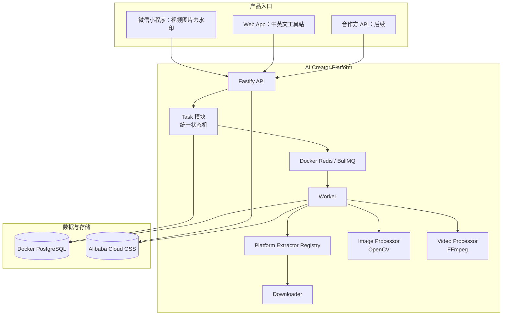
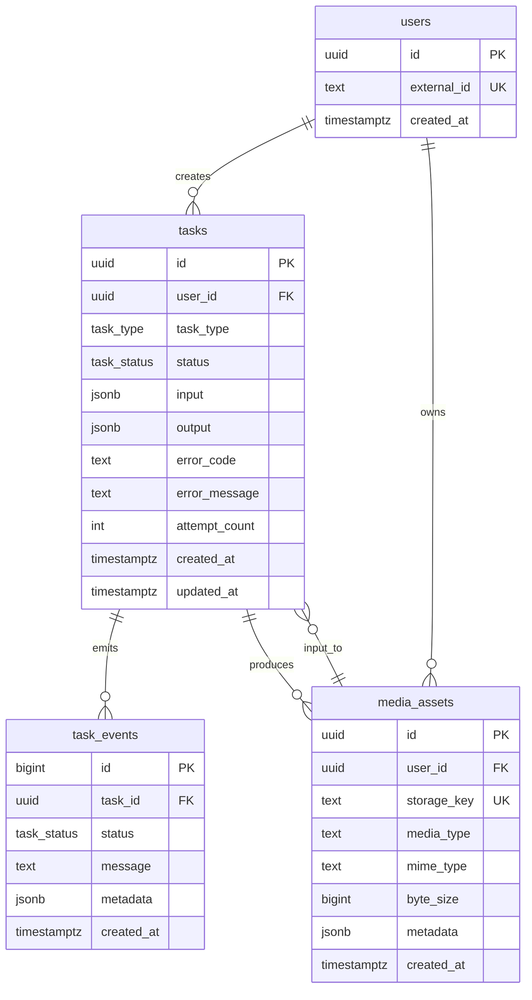
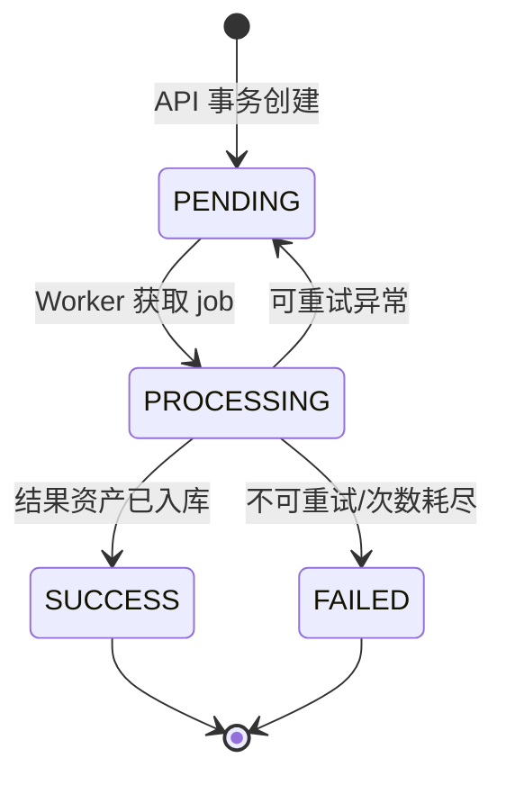

# 未然Lab · AI Creator Tools Platform — 第一阶段架构

## 目标与边界

第一阶段验证两项共用基础能力：**素材获取（Source Download）** 与 **素材清理（Watermark Remove）**。当前交付的小程序以平台首页和工具分类承载图片、视频去水印能力；视频工具采用“选择平台 + 公开 URL”的入口，下载和清理仍共享同一后台。

不在第一阶段范围：资讯流、会员体系、支付、社交关系、平台账号登录或绕过受版权/访问控制保护的内容。调用方必须确认对输入媒体和 URL 具备处理、下载及二次使用的权利。

## 系统架构图



### 关键原则

- **Task-first：** 耗时、需要持久化或媒体计算的工作以任务进入队列；只返回来源元数据和短票据的快速 Extractor 可以同步执行。
- **资产优先：** 上传件和处理结果都作为 `media_assets` 管理，任务只引用资产 ID。
- **产品无关：** 小程序、Web 和未来工具均调用同一套 Task API。
- **插件化扩展：** 新工具新增 task handler；新内容平台新增 extractor，不修改既有 API。
- **可审计：** 输入、输出、状态迁移和失败原因都会持久化。
- **原画优先：** 平台存在可公开解析的原画流时直接获取，不对带移动水印的低码率版本做伪清理或冒充原画。

## 服务拆分

当前采用可部署为两个进程的模块化单体，降低个人开发者运维成本；模块接口保持稳定，负载增长时可无缝拆成独立服务。

| 服务/模块 | 当前职责 | 未来拆分方向 |
|---|---|---|
| API | 鉴权、签名上传、任务提交、查询和客户端通知接口 | API Gateway / BFF |
| Task | 状态机、权限检查、数据库事务、队列投递 | Task Service |
| Worker | 领取任务、幂等执行、重试、结果持久化 | 按 CPU/GPU/媒体类型分队列 |
| Storage | 阿里云 OSS 对象键、受限表单签名、媒体资产元数据 | 独立 Media Asset Service |
| Processor | 图像/视频去水印的受控命令适配层 | Image/Video Processing 服务 |
| Extractor | URL 识别与媒体源标准化 | 平台 Connector 服务 |
| Downloader | 受许可 URL 的流式下载与校验 | 下载 Worker 池 |

## 数据库设计



`tasks.input` 采用按任务类型校验的 JSON；它保证不断新增工具时无需频繁改表。可查询字段（状态、用户、类型、创建时间）保留为显式列并建立索引。

## API 设计

所有接口以 `/v1` 为前缀。除健康检查、能力查询与微信登录外，接口都需要 `Authorization: Bearer <JWT>`。小程序通过 `wx.login` 获取一次性 `code`，后端调用微信 `code2Session`，再签发仅包含平台用户 ID 的短期 JWT；不会把 `session_key` 返回给客户端或入库。

| 方法 | 路径 | 说明 |
|---|---|---|
| `GET` | `/health` | 存活与依赖检查 |
| `GET` | `/v1/capabilities` | 已启用任务类型及客户端配置 |
| `POST` | `/v1/auth/wechat` | 以 `wx.login` 的 code 换取 JWT |
| `POST` | `/v1/assets/upload-url` | 创建资产记录并返回阿里云 OSS 受限表单上传签名 |
| `POST` | `/v1/assets/:assetId/complete` | 服务端确认对象已上传，资产变为可处理状态 |
| `POST` | `/v1/sources/resolve` | 同步解析公开来源，返回媒体清单与 Redis 短票据 |
| `GET` | `/v1/source-media/:ticket` | 按需代理预览/下载源媒体，不在扫描阶段写入 OSS |
| `POST` | `/v1/tasks` | 创建并投递统一任务 |
| `GET` | `/v1/tasks?limit=20` | 查询当前用户的任务历史，用于“我的”与文件记录 |
| `GET` | `/v1/tasks/:taskId` | 查询任务、输入输出与错误 |
| `GET` | `/v1/tasks/:taskId/result-url` | 成功后返回短期下载 URL |

### 创建任务示例

```json
{
  "taskType": "IMAGE_WATERMARK_REMOVE",
  "input": {
    "sourceAssetId": "a4c5eab2-3be1-4e04-a4f2-54a1c2137a71",
    "regions": [{ "x": 0.72, "y": 0.86, "width": 0.2, "height": 0.08 }]
  }
}
```

坐标一律为相对比例 `0..1`，从左上角开始计算，因而在小程序预览和 Worker 原始分辨率之间保持一致。

公开来源发现不创建异步任务：

```json
{
  "platform": "dola",
  "url": "https://www.dola.com/thread/xL02pFHSUcQEQa3ME"
}
```

平台解析器负责发现全部媒体项并选择原画流。一个 Thread 可同步返回多个结果；API 为每项生成 256-bit 随机短票据，源 URL 和必要请求头只在 Redis 中按 TTL 保存，客户端点击后才通过同域流式端点传输。票据过期后必须重新解析。需要上传、转码或持久化结果的媒体操作才进入 Task/Worker/OSS。

## Task 系统设计



1. API 验证输入，创建 `tasks` 和首个 `task_events`。
2. 事务提交后将任务 ID 写入 Docker Redis 队列；队列重复投递不会重复处理，因为 Worker 只允许 `PENDING → PROCESSING` 的原子迁移。
3. Worker 只处理需要持久化或计算的任务。Dola 快速发现由 API 调用 Extractor，同步解析无动态水印的 H.264 原画流；扫描时不下载视频、不写 OSS。
4. 每次状态变化均写事件。未知错误由 BullMQ 按退避策略重试；最终失败落库可供客户端展示。
5. 客户端以轮询查询为基线；后续可增加 WebSocket、订阅消息或 webhook，而不改变 Task 模型。

## Worker 设计

- 队列名按工作负载划分：`media-cpu`（当前），未来可添加 `media-gpu`、`source-download`。
- 单一 job 的唯一 ID 使用 task ID；最大尝试次数由 `TASK_MAX_ATTEMPTS` 配置。
- Worker 将所有外部命令限制为固定二进制与白名单参数，不将用户输入拼接为 shell。
- 单个处理工作目录在任务结束后清理；对象存储路径采用 `uploads/{user}/{asset}` 与 `results/{user}/{task}`。
- 每个处理器只接受经 Zod 校验的输入，不识别的任务类型立即失败。
- Dola 解析器只接受公开 `dola.com/thread/...`、官方 VOD 元数据主机和 Dola 视频 CDN；拒绝跳转与非白名单地址。原画不可用时任务明确失败，不退回移动水印版本。
- 源媒体票据采用不可预测的随机 ID 并设置短有效期，避免将很长的源地址放进 URI；代理端再次执行 HTTPS/公网地址校验，只转发白名单请求头与合法的单段 `Range`，支持视频拖动播放。
- 内部 SDK、网络和对象存储异常只写服务端日志；任务与 API 对客户端仅返回稳定错误码和安全文案，历史 `error_message`/事件 metadata 不直接序列化到客户端。

## 微信小程序页面结构

```text
apps/miniprogram/
  pages/
    index/                 # 平台欢迎、常用工具和分类入口
    tools/                 # 所有工具与未来能力分类
      image-watermark/     # 选图、框选区域、提交任务
      video-watermark/     # 选择平台、扫描公开 URL、同页预览与下载
    profile/               # 历史任务、文件记录、设置入口
    tasks/                 # Task 系统驱动的任务与结果记录
    task-detail/           # 轮询状态、预览和保存单个或多个结果
  services/api.js          # 统一 API 请求与上传
  utils/regions.ts         # 画布比例坐标转换
```

小程序使用“首页 / 工具 / 我的”三 Tab 架构：首页展示平台定位、常用工具与分类；工具页展示完整工具目录；我的页聚合历史任务与文件记录。它不包含新闻、AI 情报、社区、会员或支付入口；AI 情报媒体应作为公众号、网站、短视频等独立系统运营。

Web 采用“首页 + 全部工具 + 四大工作区 + 专属工具页”的站点结构。素材下载、图片、视频、创作辅助是同级能力；每个 AI 应用可以拥有专属 URL，但只有通过生产验证的 Connector 才显示可操作表单。完整路由、SEO 与广告位规则见 `docs/web-information-architecture.md`。

## Source Download 扩展契约

```ts
interface SourceExtractor {
  readonly id: string;
  canHandle(url: URL): boolean;
  extract(url: URL): Promise<MediaSource>;
}
```

`MediaSource` 包含 `originalUrl`、来源标题和 `items[]`；每个媒体项再标准化 `mediaType`、`title`、`cover`、`duration` 与 `streams[]`，因此一个页面可返回多个视频。每一个来源平台单独实现 connector，例如 `DolaExtractor`、`YoutubeExtractor`、`TikTokExtractor`。连接器只能处理授权的、可公开获取的素材，且应遵守源站条款和版权限制。
